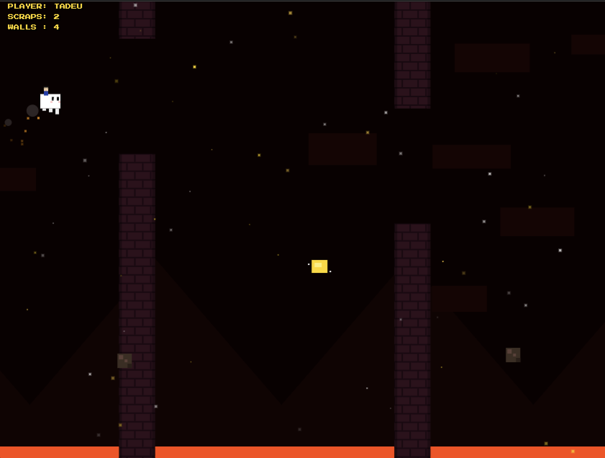

# GhastRider 🚀🔥

A high-performance, 16-bit arcade flight simulator built with **Vanilla JavaScript** and **HTML5 Canvas**. Navigate through the treacherous Nether, collect ancient debris (scraps), and use shiny gold nuggets to phase through walls while competing on a dynamic global leaderboard.

---

## 📸 Preview


---

## 🎮 About the Game
In **GhastRider**, the objective is simple but challenging: fly your hero and their happy Ghast friend through the treacherous Nether Fortress. 

- **Survival:** Avoid the deep purple fortress walls and the bubbling lava below.
- **Scraps:** Collect dark "Netherite Scraps" to boost your score.
- **Power-Ups:** Keep an eye out for the rare **Super Shiny Gold Nugget**. Collecting it grants **Wall Immunity for 5 seconds**. A visual blinking effect will warn you 2 seconds before the power-up expires.
- **Dynamic Roster:** The game automatically fetches player names from your database and assigns them unique sprites based on the name found in the leaderboard.

---

## 🛠️ Technical Highlights
- **Delta-Time Scaling:** Movements are calculated based on frame timing, ensuring the game runs at the same speed on a 60Hz mobile screen as it does on a 144Hz desktop monitor.
- **Smart Spawning:** Items are algorithmically placed to ensure they never spawn inside fortress brick hitboxes.
- **Atmospheric Rendering:** Features a multi-layered parallax background with foreground "Sparkling Ash Rain" and motion-blurred smoke trails.
- **Mobile Hardened:** Specifically designed to prevent accidental browser zooms, context menus, or text selection during intense tapping sessions.

---

## 🚀 Getting Started

### 1. Prerequisites
This is a self-contained web app. You only need a modern web browser (Chrome, Safari, Firefox, Edge) to run it.

### 2. Firebase Realtime Database Setup
The leaderboard and character selection system rely on a Firebase Realtime Database.

1. Create a project in the [Firebase Console](https://console.firebase.google.com/).
2. Create a **Realtime Database**.
3. Set your **Rules** to allow public reads/writes (or configure secure access as needed):
   ```json
   {
     "rules": {
       ".read": true,
       ".write": true
     }
   }
   ```
4. **Initial Data Schema:** Import or manually add this JSON structure to your database to seed the initial players (**Theo, Tadeu, Luise, and Max**):
   ```json
   {
     "leaderboard": {
       "Theo": { "scraps": 0, "walls": 0 },
       "Tadeu": { "scraps": 0, "walls": 0 },
       "Luise": { "scraps": 0, "walls": 0 },
       "Max": { "scraps": 0, "walls": 0 }
     }
   }
   ```

### 3. Configuration
Open the game HTML file and locate the `GAME_CONFIG` object at the top of the script:

```javascript
const GAME_CONFIG = {
    // Replace with your actual Firebase URL
    firebaseURL: "[https://your-project-id.firebaseio.com/leaderboard](https://your-project-id.firebaseio.com/leaderboard)",
    defaultPlayers: ["Theo", "Tadeu", "Luise", "Max"]
};
```
Replace the `firebaseURL` string with your actual Firebase Realtime Database endpoint.

---

## 🕹️ Controls
- **Desktop:** Press **Space** or **Arrow Up** to fly. Press the same keys to restart after a mission fails.
- **Mobile:** Tap and hold anywhere on the screen to fly.

---

## 🤖 AI Assistance
This project was developed with significant AI collaboration:
- **Gemini (Google):** Acted as the primary architect for the physics engine, character logic, Delta-Time scaling, and advanced atmospheric effects.
- **ChatGPT (OpenAI):** Contributed to initial logic structures and UI refinements.

---

## 📝 License
This project is open-source. Feel free to fork it, add new characters, or customize the Nether's atmosphere!

Created with Gemini by Tadeu
